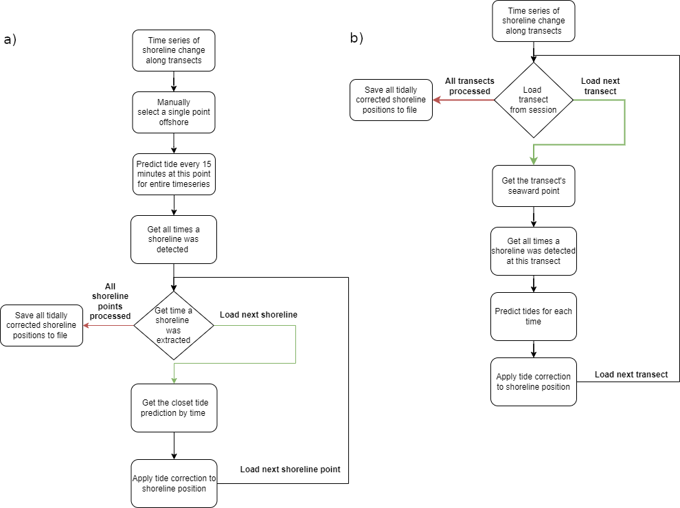

<!-- --------------------------------------- -->
# Summary
``CoastSeg`` is an interactive browser-based program consisting of jupyter notebooks and python scripts that aims to broaden the adoption of satellite-based shoreline detection (SDS) and coastal landcover mapping workflows among coastal scientists and practioners. SDS is a sub-field of coastal sciences that aims to detect and post-process a time-series of shoreline locations from a time-series of publicly available satellite imagery [@turner2021satellite; @vitousek2023future]. ``CoastSeg`` is a python package installed via pip into a conda environment. ``CoastSeg`` also provides jupyter notebooks and python scripts that call functions and classes in the ``CoastSeg`` core functionalities for specific workflows. All API codes, notebooks, scripts, and documentation are hosted on the ``CoastSeg`` github repository.

CoastSeg has three broad aims. The first is to be an API consisting of core SDS workflow functionalities such as file input/output, image downloading, geospatial conversion, tidal model API handling, mapping 2d shorelines to 1d transects, and numerous other workflows common to a basic SDS standard, without the implementation of a particular waterline estimation workflow. This workflow is crucial to the success of any SDS workflow because it is the step that identifies the waterline, or the boundary between sea and land. The idea behind CoastSeg designed as an API is so users could extend or customize functionality using scripts and notebooks.

The second aim of CoastSeg is therefore to provide fully functioning SDS implementations in an accessible browser notebook format. Our principal objective to date has been to re-implement and improve upon a popular existing toolbox, ``CoastSat`` [@vos2019coastsat], allowing the user to carry out the well-established ``CoastSat`` SDS workflow [@castelle2021satellite; @vos2023pacific; @vos2023benchmarking; @warrick2023large; @konstantinou2023satellite], but in a more accessible way within the ``CoastSeg`` platform. In order to acheive this, we created and maintain ``CoastSat-package`` [@voscoastsat], a python package installed via pip into the ``CoastSeg`` conda environment that contains re-implemented versions of many of the original ``CoastSat`` codes. The ``CoastSeg`` re-implementation of the ``CoastSat`` workflow is end-to-end within a single notebook. That notebook allows the user to by enabling users to, among other tasks: a) define a region of interest on a webmap and upload geospatial vector format files; b) define, download and post-process satellite imagery; c) identify waterlines in that imagery using the ``CoastSat`` method [@vos2019coastsat]; d) correct those waterlines to elevation-based shorelines using tidal elevation-datum corrections provided through interaction with the pyTMD [@alley2017pytmd] API; and e) download output files in a variety of modern geospatial and other formats for subsequent analysis. 

The third and final aim of ``CoastSeg`` is to implement a method to carry out SDS workflows in experimental and collaborative contexts, which aids both oversight and reproducibility as well as practical needs based on division of labor. We do this using workflow ``sessions``, a system that enables users to iteratively experiment with different combinations of settings. ``CoastSeg`` enables fully reproducible workflows because everything is saved in a way such that a users can share their sessions with others, enabling peers to replicate experiments, build upon previous work, or access data downloaded by someone else. This simplifies handovers to new users from existing users, simplifies teaching of the program, and encourages collective experimentation which may result in better shoreline data.

``CoastSeg`` is designed to be extendable, serving as a hub that hosts alternative SDS workflows and similar workflows that can be encoded in a jupyter notebook built upon the ``CoastSeg`` and ``CoastSat-package`` core functionalities. Additional notebooks will carry out shoreline extraction and coastal landcover mapping using alternative methods. The first is an alternative SDS workflow based on a deep-learning based semantic segmentation model, that we briefly summarize at the end of this paper. To implement a custom waterline detection workflow, the originator of that workflow would contribute a new jupyter notebook, and also likely contribute to the ``CoastSeg`` source code to add their specific waterline detection algorithm there, that they could call in their notebook. 

<!-- see the data they want to download, see their shorelines on the map, and more all within one tool. Normally users would need to switch between a variety of tools to download the satellite data, extract shorelines, apply tidal correction, and more, but ``CoastSeg`` allows users to do all this in a single location all with a completely reproducible workflow. -->


<!-- - add a section that explains that coasteg is extendable
- users can create their own workflows by adding a new notebook and calling the coastseg api -->

<!-- --------------------------------------- -->

# Statement of Need
Coastal scientists and practioners now have access to extensive collections of satellite data spanning more than four decades. However, it's only in recent years that advancements in algorithms, machine learning, and deep learning have enabled the automation of processing this satellite imagery to accurately identify and map shorelines from imagery, a process known as Satellite-Derived Shorelines, or SDS. SDS workflows are gaining rapidly in popularity, and in particular the ``CoastSat`` workflow for instantaneous SDS, that is, one shoreline extracted per timestamped image, has been widely adopted since its release in 2018 [@vos2019coastsat]. Existing open-source software for SDS often require the user to navigate between platforms (non-reproducible elements), develop custom code, and/or engage in substantial manual effort.

We sought to build a platform that not only allowed the user to adopt the ``CoastSat`` workflow in a re-implementation than ran in a single jupyter notebook, quicker, and more seamlessly, but also one that facilitates experimentation with the many settings that can govern shoreline accuracy, extent, and number. Further, ``CoastSeg`` has been designed specifically to host alternative SDS workflows, recognizing that it is a nascent field of coastal science, and the optimal methodologies for all coastal environments and sources of imagery are yet to be established. Therefore ``CoastSeg`` will provide a means with which to extract shorelines using multiple methods and adopt the one that most suits their needs, or implement a new methof of their own devising on the ``CoastSeg`` platform.

We summarize the needs met by the ```CoastSeg``` project as follows:

* A re-implementation of (and improvement of) the CoastSat workflow with pip-installable APIs, and ``coastsat-package``.

* A browser-based workflow and an interactive mapping interface provided by Leafmap [@wu2021leafmap].

* A more accessible, entirely graphical and menu-based SDS workflow, with no exposure of source code to the user.

* A session system that makes experimenting to discover the setting that optimal extract shorelines from satellite imagery.

* Improved core SDS workflow components, such as faster and more seamless tidal correction workflow, and faster image downloading.

* Consolidation of workflows in a single platform and reusable codebase.

* An extendable hub of alternative SDS workflows in one location.

<!-- In today's technological landscape, we have access to extensive collections of satellite data spanning decades. However, it's only in recent years that advancements in algorithms, machine learning, and deep learning have enabled the automation of processing this satellite imagery to accurately identify and understand its features. While a variety of independent tools are available, both free and subscription-based, to assist in data processing, using these tools often require researchers to navigate amongst various platforms, develop custom code, and  it means switching amongst various tools, writing custom code to process the data,and engage in substantial manual efforts to extract meaningful features from the imagery. -->

<!-- ``CoastSeg`` is a free, open-source Python package designed to streamline the process of downloading satellite imagery and extracting shorelines from a large volume of images, all within a single integrated platform. ``CoastSeg`` simplifies the extraction of shorelines from satellite imagery by providing comprehensive tools for the entire process. Users can view their extracted shorelines directly on the map, easily download data from Google Earth Engine, and perform tide corrections more efficiently than with existing tools. -->


  <!-- ``CoastSeg`` differentiates itself from the similar software CoastSat [site] by providing an interactive mapping interface, a session system that makes experimenting to discover the setting that optimal extract shorelines from satellite imagey.  ``CoastSeg`` incorperates  functionality from other Python packages Coastsat [site] and Leafmap [site].

  - Rephrase this to say coastseg is built with coastsat and leafmap to make it extendable and customizable
 - Organize how coastseg improves on coastsat
 - mention stable downloads, provides default shorelines and transects, detailed logs and sharable sessions

 The advantages of using ``CoastSeg`` over CoastSat are that with ``CoastSeg`` you can easily see what data you want to download on the mapping interface [reference figure], downloaded data & extracted shorelines can be shared with other users through a session system and a tide correction workflow is included making ``CoastSeg`` a all in one tool for extracting shorelines. This makes ``CoastSeg`` a more advanced and user-friendly alternative to CoastSat, offering a seamless, end-to-end experience for users in this field. -->

<!-- ``CoastSeg`` offers a user-friendly and interactive approach to shoreline extraction from satellite imagery. Its interface allows users to visually identify and select specific regions of interest (ROI) to download multispectral data at. Once the data has been aquired users can load their reference shorelines and transects onto the map to gain a spatial understanding of where in their imagery CoastSeg will attempt to the load the reference shoreline from. While there are other tools with similar capabilities, they often fall short in providing an intuitive user interface that simplifies and guides the process. A standout feature of "CoastSeg" is its provision of default reference shorelines and transects. This eliminates the need for users to supply their own data or manually draw reference shorelines, making it significantly more accessible and user-friendly, especially for those new to the field or without extensive technical backgrounds. -->

<!-- --------------------------------------- -->

# Implementation of core SDS workflow

## Architecture & Design
At a high level, ``CoastSeg`` is designed to be an accessible and extendible hub for both ``CoastSat``-based and alternate workflows, each of which is implemented in a single notebook. The user is therefore presented with a single menu of notebooks, each of which calls on a common set of core functionalities provided by ``Coastseg`` and ``Coastsat--package``, and exporting data to common file formats and conventions. 

CoastSeg is installable as a pip package into a conda environment. ``CoastSeg`` notebooks are accessed from GitHub. We also created a pip package for the ``Coastsat`` workflow in order to a) improve the ``CoastSat`` method's software implementation without affecting the parent repository, and b) to install as a pip package into a conda environment, rather than duplicate code from CoastSat. 

``CoastSeg`` is built with a object-oriented architecture, where elements required by the ``CoastSat`` workflow such as Regions of Interest, reference shorelines, and transects are represented as distinct classes on the map. Each class stores data specific to that feature type as well as encompassing methods for styling the feature on the map, downloading default features, and executing various post-processing functions.


## Sessions 
SDS workflows require settings in order to extract optimal shorelines. There are numerous settings in the ``CoastSat`` workflow, and sometimes determining optimal shorelines can be an iterative process requiring experimentation with settings. Sub-optimal shoreline extraction may result merely through user fatigue. Therefore, ``CoastSeg`` employs a `session`-based system that enables users to iteratively experiment with different combinations of settings. Each time the user makes adjustments to the settings used to extract shorelines from the imagery a new session folder is saved with the updated settings. This session system is what makes ``CoastSeg`` fully reproducible because all the settings, inputs, and outputs are stored within each session as well as a reference to what downloaded data was used to generate the extracted shorelines in the session. Moreover, the session system in "CoastSeg" fosters a collaborative environment. Users can share their sessions with others, enabling peers to replicate experiments, build upon previous work, or access data downloaded by someone else. This simplifies the process for new users and encourages collective experimentation and data sharing. This reproducibility and collaboration are beneficial in research contexts.


## Improvements to the CoastSat workflow

### Accessibility
``CoastSeg`` facilitates entirely browser-based workflows with an interactive webmap and ipywidget controls (Figure 1). It interfaces with the Zenodo API to download reference shorelines for any location in the world, organized into 5x5 degree chunks in geoJSON format [@buscombe_2023_7786276] as well as transects, themselves providing beachface slope metadata [@buscombe_2023_8187949] available on hover. We have implemented rigorous error handling using developer log files, user report files, and informative error messages that suggest problem fixes. We have also provided a set of utility scripts for common data input/output tasks, oftem the result of specific requests from our software testers (see Acknowledgements). As well as a project wiki and improved documentation, we have researched min, max, and recommended values for all settings, and have provided visual project management aids.

### Performance
We impelemented faster image retrieval from Google Earth Engine ... more details

We impelemented more stable (near-uninterruptible) image downloading ... more details

We added helpful workflow components such as image filtering options; for example, users can now filter their imagery based on image size and the proportion of no data pixels in image. Additionally, the user can decide to turn off cloud masking, which is necessary when the cloud masking process fails and obscures non-cloudy regions such as bright pixels of sand beaches. Finally, we replaced non-cross-platform components of the original workflow, for example the pickle format was replaced with JSON or geoJSON formats which are both human-readable and compatible with GIS and webGIS.

{#sylt width="100%"}


### Tide
Tidal correction (Figure 2) of shorelines involves estimating the tide height for any location and time using the pyTMD [@alley2017pytmd] API to model the tide. pyTMD provides an accessible script for FES14 [@lyard2021fes2014] tidal model data access, includes several models other than FES14 including polar-specific models. We created an automated workflow that splits the FES2014 model data into 11 global regions (an idea adopted from DEA-coastlines). This allows the program to access only a subset of the data, facilitating fast tide estimates (in minutes rather than hours for long satellite time-series).

{#sylt width="100%"}

<!-- --------------------------------------- -->

# Implementation of an Alternative Deep-Learning-Based SDS Workflow

As we noted above, we have developed a notebook that carries out an alternative SDS workflow based on a deep-learning based semantic segmentation model. To implement this custom workflow, we created a new jupyter notebook, and added source code to the ``CoastSeg`` API. The changes ensured that the inputs and outputs were those expected by the ``CoastSeg`` core API. We call this alternative workflow the ``Zoo`` workflow, in reference to the fact that the deep learning models implemented originate from the ``Segmentation Zoo`` github repository, and result from the ``Segmentation Gym`` deep-learning based image segmentation model training package [@buscombe2022reproducible]. Figure 3 describes in detail how the two workflows differ.

<!-- --------------------------------------- -->

# Acknowledgements
The author would like to thank Qiusheng Wu, developer of ``Leafmap``, whichs adds a lot of functionality to ``CoastSeg``. Thanks also to the developers and maintainers of pyTMD, DEA-tools, xarray, and GDAL, without which this project would be impossible. We acknowledge contributions from Robbi Bishop-Taylor, Evan Goldstein, Venus Ku, software testing and suggestions from Eli Lazarus, Andrea O'Neill, Ann Gibbs, Kathryn Weber, and Julia Heslin, and support from USGS Coastal Hazards and Resources Program, and Merbok Supplemental. 

<!-- --------------------------------------- -->

# References


